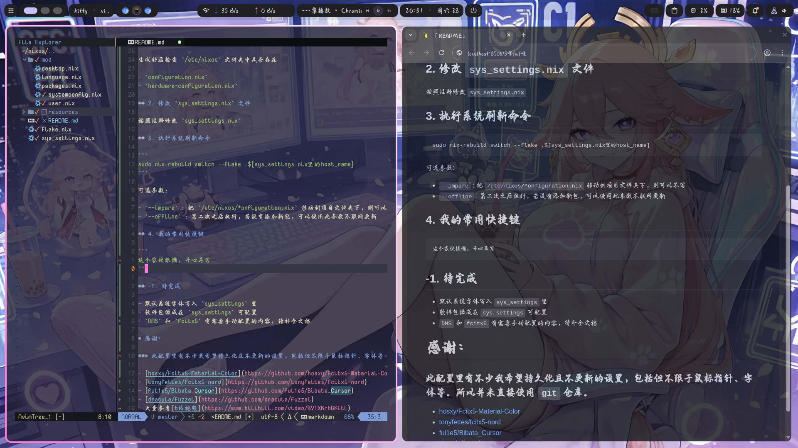

# 配置说明

这是一个 `nixos` 的 `niri` + `DMS` 的美化配置



_注_：**虚拟机启动一定要开 `openGl` 和 `3d加速` ！！！！**，或者显卡直通。

## 1. 硬件配置生成

备份 `/etc/nixos` ，执行以下命令

```sh
sudo rm /etc/nixos/configuration.nix
sudo nixos-generate-config
```

生成好后检查 `/etc/nixos` 文件夹中是否存在

- `configuration.nix`
- `hardware-configuration.nix`

## 2. 修改 `sys_settings.nix` 配置

克隆仓库

```bash
git clone https://github.com/foolish-duckegg/my_nix_conf.git
```

进入目录,复制模板文件为 `sys_settings.nix`，按照注释修改配置

```bash
cd my_nix_conf
cp sys_settings_default.nix sys_settings.nix
vi ./sys_settings
```

## 3. 执行系统刷新命令

```
sudo nix-rebuild switch --flake .$[sys_settings.nix里的host_name]
```

可选参数:

- `--impare` : 把 `/etc/nixos/*onfiguration.nix` 移动到项目文件夹下，并且改 `./flake.nix` 里的 `/etc/nixos/configuration.nix` -> `./configuration.nix`，则可以不写
- `--offline` : 第二次之后执行，若没有添加新包，可以使用此参数不联网更新

若在大陆遇到 `Go` 代理问题，可以先执行 `export GOPROXY=https://goproxy.cn,direct` 指定国内镜像

## 4. 重启电脑

```
reboot
```

## 5. DMS 桌面配置修改（可选）

此处我记录我使用的配置，可以不按照这里的配置。

- fcixt 配置
  1. 右键右上角键盘图标，点击配置
  2. 双击 "中州韵"，让他进入左边，点击应用
  3. 点击标签栏 “Addons”，配置“经典用户界面”的主题，选择`Nord-Light` 和 `Nord-Dark`，点击应用
  4. 点击标签栏 “Global Options”，切换输入法改成 ”左 Ctrl“，取消 “临时切换输入法”，点应用
  5. !!! : **右键右上角键盘图标，点击重启。然后监视** `~/.local/share/fcitx5/rime/build` **，直到文件夹数量不再变化，才能使用输入法。** 10+ 个文件。否则使用太快，rime还没编译完，导致看起来和崩了一样。每次重新部署输入法都建议如此。
- DMS 配置
  1. 壁纸
     - 在概览中模糊 on
     - 自动轮换 on
     - 过度效果 随机
  2. 主题与配色
     - 主题色 动态
     - Matugen配色方案 音色斑点
  3. 排版与动画
     - 改字体
  4. Dank Bar
     - 设置 -> 透明度 30%
     - 部件 -> 左侧 (启动器 工作区切换器 当前窗口 活动应用程序)
     - 部件 -> 中间 (实时网速 媒体控制 时钟 电源)
     - 部件 -> 右侧 (系统托盘 剪切板管理 cpu占用 内存占用 通知中心 控制中心)

## 6. 我的常用快捷键

```
这个家伙很懒，开心再写
```

## -1. 待完成

- nvim 自动补全快捷键设置
- 默认系统字体写入 `sys_settings` 里
- 软件包做成在 `sys_settings` 可配置
- `DMS` 和 `fcitx5` 有需要手动配置的内容，待补全文档

# 感谢：

### 此配置里有不少我希望持久化且不更新的设置，包括但不限于鼠标指针、字体等。所以并未直接使用 `git` 仓库。

- [hosxy/Fcitx5-Material-Color](https://github.com/hosxy/Fcitx5-Material-Color)
- [tonyfettes/fcitx5-nord](https://github.com/tonyfettes/fcitx5-nord)
- [ful1e5/Bibata_Cursor](https://github.com/ful1e5/Bibata_Cursor)
- [dracula/fuzzel](https://github.com/dracula/fuzzel)
- 大量参考[b站视频](https://www.bilibili.com/video/BV1XKrbBKEtL)
